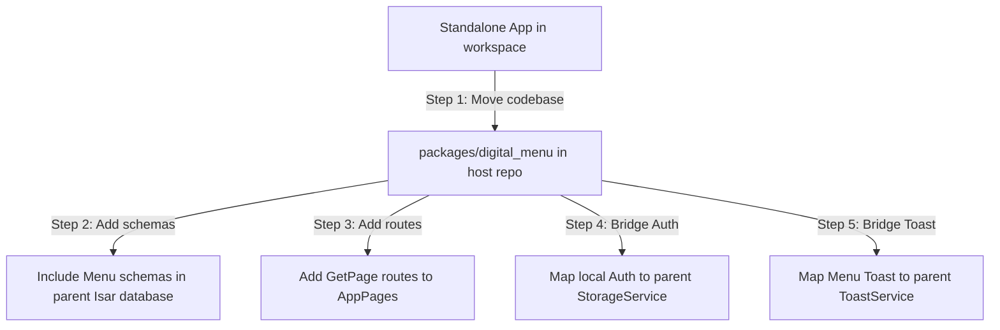

# Standalone eResto Digital Menu Plan (GetX + Isar)

This document details the plan to build the **eResto Digital Menu** (`eresto_menu`) as a standalone application *directly inside this workspace* (`d:\Projects\Flutter\eresto_digi_menu_flutter`). 

To satisfy the requirement that this app will later be merged/integrated into the **eResto Edge Tablet** app (`eresto_edge_flutter`), we will build the standalone app using the **GetX + Isar** architecture from Day 1. This ensures that the eventual merge will require **zero rewriting** of state management or local databases.

---

## 1. Enterprise Architecture: MVVM Pattern

We will implement a clean **MVVM (Model-View-ViewModel)** architectural pattern. 

```
lib/
├── main.dart                             # App initialization
├── app.dart                              # GetMaterialApp + routing
│
├── core/                                 # Common core layer
│   ├── api/
│   │   ├── api_client.dart               # Dio instance, base URL, headers
│   │   ├── api_exception.dart            # Typed exception class
│   │   └── endpoints.dart                # REST endpoints constants
│   │
│   ├── storage/
│   │   ├── storage_service.dart          # Token storage (SharedPreferences / GetxService)
│   │   └── database_service.dart         # Isar DB service (GetxService)
│   │
│   ├── services/
│   │   └── toast_service.dart            # Toastification service
│   │
│   ├── theme/
│   │   ├── app_theme.dart                # Light + Dark ThemeData
│   │   ├── app_colors.dart               # Brand colors
│   │   └── app_dimensions.dart           # Dimensions & margins
│   │
│   ├── router/
│   │   └── app_pages.dart                # GetX routing table
│   │
│   └── utils/
│       ├── responsive.dart               # Sizing helpers (ScreenUtil)
│       └── formatters.dart               # Currency and date helpers
│
└── features/                             # Feature-sliced folders
    ├── auth/                             # Custom Auth feature for Standalone mode
    │   ├── bindings/                     # GetX dependency mapping
    │   ├── data/                         # Remote & Local datasources
    │   ├── domain/                       # Freezed data models
    │   └── presentation/                 # Controllers & Views
    ├── items/
    ├── dashboard/
    ├── menu/
    └── share/
```

### Layer Responsibility
- **Data (Model)**: Remote DataSource (Dio API client) and Local DataSource (Isar collections) communicating via Repository classes. Returns Dartz `Either<Failure, Success>` to keep ViewModels exception-free.
- **ViewModel**: `GetxController` implementing state machines. Exposes observables (`Rx` lists, loading states, edit flags) and intents (e.g., `fetchItems()`, `toggleAvailability()`). Includes no widget/theme references.
- **View**: Dumb Flutter page widgets (`GetView<ViewModel>`) relying strictly on `Obx` observers. Captures gestures and routes actions to the Controller.

---

## 2. Key Standalone Caching & Storage (Isar)

We will use **Isar** instead of Hive. Since the parent app `eresto_edge_flutter` already compiles and uses Isar, using Isar in this standalone app avoids adding Hive dependencies and ensures the caching schemas are 100% ready for migration.

We will define 4 collections:
- `MenuItemCollection`: caches the list of menu items.
- `MenuTemplateCollection`: caches templates.
- `MenuSessionCollection`: caches sessions.
- `DashboardAnalyticsCollection`: caches scan analytics (with a 5-minute TTL stamp).

---

## 3. Toast & Smart Error Handling

The standalone app will implement its own custom `ToastService` utilizing `toastification: ^2.3.0` (matching the host app's styling).
- **Standard Alerts**: Success, Info, Warning, and Error messages shown as smooth toast overlays.
- **Technical Dialogs**: Technical failures (connection timeouts, 500 server errors, SQLite parsing exceptions) trigger a bottom sheet overlay allowing developers and operators to "Share to Tech" (exactly like the parent app).

---

## 4. Brand Color Alignment

To ensure visual consistency between the standalone app and the Edge app, we will use the exact color scheme from `eresto_edge_flutter` in `core/theme/app_colors.dart`:

- **Primary Brand Color**: `Color(0xFFAB2421)` (Crimson Red)
- **Primary Dark Color**: `Color(0xFF7A0000)` (Dark Crimson)
- **Primary Light (Selected/Tint)**: `Color(0xFFFAE6E5)`
- **Scaffold Background**: `Color(0xFFF5F5F5)`
- **Card/Surface Colors**: `Color(0xFFFFFFFF)`
- **Text Primary (Ink900)**: `Color(0xFF0F0F0F)`
- **Text Secondary (Ink600)**: `Color(0xFF4B4B4B)`
- **Borders (Ink200)**: `Color(0xFFE4E4E2)`
- **Success State**: `Color(0xFF1E6B3C)`
- **Warning State**: `Color(0xFF8A5200)`

This matches the core theme setup inside `eresto_edge_flutter` and makes integration seamless.

---

## 5. Dual-Mode Integration Strategy (Preparing for the Edge merge)

By building the standalone app on GetX + Isar today, the future integration into `eresto_edge_flutter` is simplified:



Since both projects will use the exact same versions of GetX, Isar, Dio, and ScreenUtil, the integration can be completed in a few hours without rewriting a single line of business logic!

---

## 6. Step-by-Step Build Order Plan

### Step 1: pubspec.yaml & Environment Configuration
1. Update `pubspec.yaml` with required versions of GetX, Isar, Dio, Freezed, ScreenUtil, and Toastification.
2. Align minimum SDK versions (Android 23, iOS 13.0, Target Android 34).
3. Confirm dependency resolution (`flutter pub get`).

### Step 2: Core Platform Setup
1. Define Isar Collections and run `build_runner` to generate schemas.
2. Initialize `DatabaseService` (Isar) and `StorageService` (SharedPreferences) as GetxServices.
3. Configure `ApiClient` with Dio interceptors for auth header injections and 401 handling.
4. Implement `ToastService` utilizing `toastification`.

### Step 3: Feature Scaffolding (MVVM Order)
Implement data layer models, then viewmodels, then pages/sheets for each feature:
1. **Auth Feature**: Login page, JWT session storage in local storage, and router guards.
2. **Items Feature**: Search, category filter grids, availability switches, and `ItemEditSheet`.
3. **Dashboard Feature**: Scan graphs using `fl_chart`, active session statuses, and summary cards.
4. **Menu & Templates Feature**: Theme Picker Sheet (6 colors) and sessions configuration.
5. **Share Feature**: QR code tabs, PDF generator sheets, and WhatsApp sharing.

### Step 4: Verification & Compilation
1. Run and compile the standalone application to verify.
2. Write unit tests for repositories and viewmodels to verify validation logic and state transitions.
